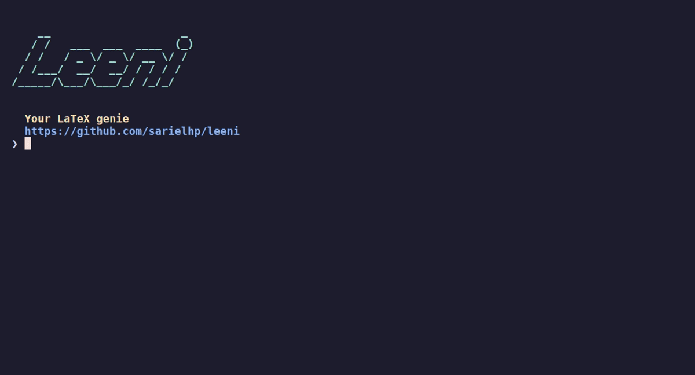
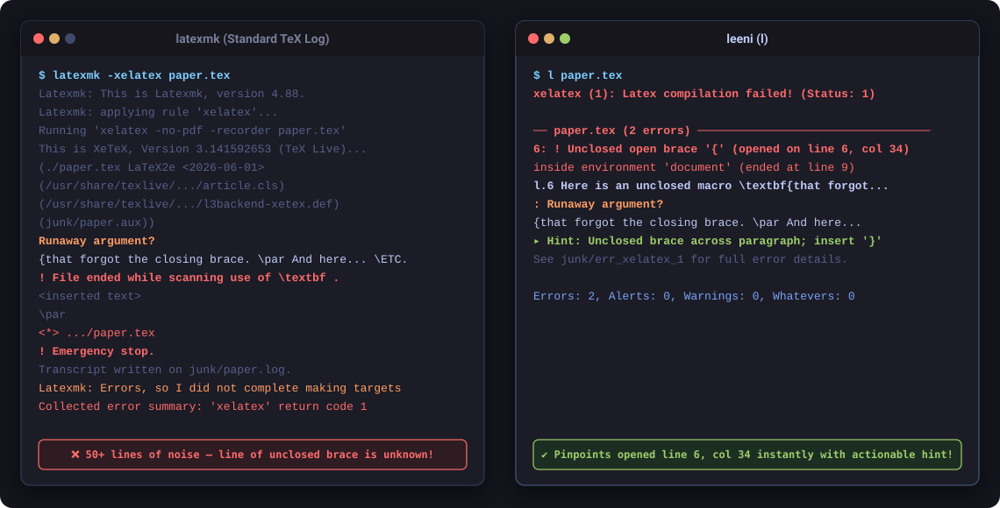

# Leeni

<p align="center">
  <a href="https://sarielhp.github.io/leeni/"><strong>Website & Documentation</strong></a> •
  <a href="https://github.com/sarielhp/leeni"><strong>GitHub Repository</strong></a> •
  <a href="https://sarielhp.github.io/leeni/gallery.html"><strong>Diagnostic Gallery</strong></a>
</p>

<p align="center">
  <a href="https://github.com/sarielhp/leeni/actions/workflows/ci.yml"></a>
  <a href="https://github.com/sarielhp/leeni/releases/latest"></a>
  <a href="https://www.ruby-lang.org">= 3.0"></a>
  
  
  <a href="docs/llm_reference.md"></a>
</p>

<p align="center">
  
</p>

**Leeni — your LaTeX genie.**

`leeni` (also invoked as `l`) brings modern compiler diagnostics (like Rust or Typst) to traditional LaTeX workflows (`xelatex`, `lualatex`, and `pdflatex`), while keeping the workspace clean and fully compatible with arXiv submission.

Like `latexmk`, it automates multi-pass convergence and bibliography processing, but adds three core architectural differences:
1. **Directory isolation**: Intermediate build files (`.aux`, `.log`, `.toc`, etc.) are confined to a `junk/` directory; only final outputs (`.pdf`, `.bbl`, `.synctex.gz`) remain in the working tree.
2. **4-tier diagnostic filtering**: Separates fatal errors and silent structural corruptions (**Alerts**) from standard warnings and harmless sub-millimeter layout noise (**Whatevers**).
3. **Dual human and agent interfaces**: Supports interactive terminal diagnostics with explanatory hints (`-x`), strict GNU compiler mode (`-cc`), and token-optimized plaintext for autonomous AI coding agents (`-llm`).

### Instant Diagnostics vs. Standard TeX Logs

Standard TeX compiler logs bury the root cause under dozens of lines of internal state, often missing the exact line where an unclosed macro or brace began. `leeni` intercepts and correlates token streams in real time to pinpoint the source and column immediately:

<p align="center">
  <a href="https://sarielhp.github.io/leeni/gallery.html"></a><br>
  <em>Explore more real-world examples in the <a href="https://sarielhp.github.io/leeni/gallery.html">Diagnostic Showcase Gallery</a>.</em>
</p>

---

## Installation

### From Source

```bash
git clone https://github.com/sarielhp/leeni.git
cd leeni
./tools/install
```

*(Installs to `~/bin/leeni` along with all shortcut symlinks (`l`, `lw`, `ll`, `lp`, etc.). Ensure `~/bin` is in your `$PATH`.)*

### Standalone Executable

To create a single-file executable without installing it, run `./tools/bundle -o leeni-standalone` from the cloned repository.

### Requirements

- **Operating System**: **Linux** (primary target; macOS is supported/functional via Homebrew/MacTeX; Windows requires WSL).
- **Ruby**: 3.0 or newer.
- **TeX Distribution**: TeX Live, MacTeX, or compatible (`xelatex`, `lualatex`, or `pdflatex`).
- **Optional**: `poppler-utils` (provides `pdftotext` for `-d` / `--update-if-changed` text diffing; `brew install poppler` on macOS).

---

## Quick Start

Run `l` inside any LaTeX project directory:

```bash
# Finds and compiles the main document automatically
l

# Or specify a file
l paper.tex
```

Everyday commands:

```bash
lw          # Fast incremental rebuild (reuses cached state)
l -f        # Force a rebuild even if files haven't changed
l -llm      # Token-optimized plaintext build for AI coding agents
l -x        # Show plain-English explanations and fixes for errors
l -C        # Clean auxiliary and temporary files
l -B        # Extract cited references into local .bib file
l -r        # Print raw compiler output (debug mode)
```

> **Tip**: For the full catalog of command-line flags, defaults, and symlink shortcuts (`ll`, `lp`, `clean_latex`), see **[docs/cli_options.md](docs/cli_options.md)** or run `l -h`.

---

## Why `leeni`?

| Capability | `leeni` | `latexmk` | `rubber` | Standard IDEs (VS Code / Overleaf) |
| :--- | :--- | :--- | :--- | :--- |
| **Intermediate file isolation** | Automatic (`junk/` subdirs mirrored; only `.pdf`, `.bbl`, `.synctex.gz` exported) | Manual (`-outdir`; can break relative `\input` paths) | Manual (`--into`) | Root directory or local `.aux` clutter |
| **Multi-pass convergence** | Dependency tracking (`.fls`) + SHA256 build state (1–10 passes) | Re-run loop on `.log`/`.aux` changes | Rule-based dependency tree | Fixed passes or background re-compilation |
| **Silent structural flaw detection** | **Alerts**: Inverted `\label` before `\caption`, duplicate labels, large overflows | None (exits 0; buried in log) | None (exits 0; buried in log) | None (treated as successful compile) |
| **Sub-millimeter noise suppression** | **Whatevers**: $\le 2.5\text{pt}$ overfulls counted in summary, hidden by default | Emits every warning to log | Emits every warning to log | Displays full warning count in problems pane |
| **AI agent & LLM mode (`-llm`)** | Built-in: pure plaintext, folded warnings, silent on clean success | None (raw log or verbose stdout) | None | None |
| **Structured JSON output** | Built-in (`--json`) | None | None | Varies (IDE internal API) |
| **Submission packaging** | Built-in (`--arxiv`, `-z`): comment stripping, flattening, sandbox audit | External scripts required | None | Overleaf export (unflattened zip) |
| **Text-diff PDF guard** | Optional (`--update-if-changed`): avoids viewer reload on non-visual edits | None | None | None |
| **Runtime dependencies** | Pure Ruby standard library (single standalone executable) | Perl + TeX Live | Python + TeX Live | Electron / Qt / Browser |

---

## Built for Humans & Autonomous AI Agents

While humans enjoy rich TrueColor terminal diagnostics and plain-English error explanation boxes (`-x`), `leeni` also provides first-class support for autonomous AI coding agents (Claude Code, Cursor, Aider, OpenCode):

- **0 tokens on success**: Exits `0` silently with zero stdout/stderr on clean builds or up-to-date targets.
- **Precise line & column diagnostics**: Emits exact `file:line:col: error: message` headers so agents jump straight to the fix.
- **Warning folding**: Automatically collapses 50+ repeated citation or layout warnings into the first 2 instances plus count, preventing context window blowout.
- **Automatic junk isolation**: Prevents AI agents from hallucinating or editing generated `.aux`, `.log`, or `.fls` files.

### Drop-in Configuration for AI Agents (`CLAUDE.md`, `.cursorrules`)

```markdown
### LaTeX Compilation Rule
When compiling or checking LaTeX documents, always use `l -llm <file>.tex` instead of `pdflatex` or `latexmk`:
- Runs in token-optimized mode (silent on clean build; exact file:line:col diagnostics on failure).
- Confines auxiliary build artifacts to `junk/` automatically.
```

*(See [docs/llm_reference.md](docs/llm_reference.md) for the complete token-optimized technical reference.)*

---

## Documentation

For technical guides, configuration options, and advanced features, see:

- **[docs/cli_options.md](docs/cli_options.md)**: Complete command-line options catalog, usage examples, and flag reference.
- **[docs/diagnostics.md](docs/diagnostics.html)**: The 4-tier diagnostic hierarchy (**Alerts** & **Whatevers** explained), error explanations (`-x`), and threshold tuning.
- **[docs/errors/README.md](docs/errors/README.md)**: Master catalog of 55 TeX/LaTeX errors with causes, solutions, and reproducers.
- **[docs/gallery.md](docs/gallery.md)**: Side-by-side diagnostic gallery comparing standard LaTeX/latexmk against leeni on real errors.
- **[docs/configuration.md](docs/configuration.md)**: Project configuration (`.l.jsonc`), global settings, and theme customization.
- **Editor Integrations**: [Visual Studio Code](docs/vscode.md) • [GNU Emacs / AUCTeX](docs/emacs.md) • [Vi / Vim / Neovim](docs/vim.md).
- **[docs/arxiv.md](docs/arxiv.md)**: arXiv submission packaging, flattening, comment stripping, and verification.
- **[docs/orchestration.md](docs/orchestration.md)**: Orchestrating complex multi-chapter and book setups using `just` and `leeni`.
- **[docs/advanced_topics.md](docs/advanced_topics.md)**: Advanced paper packaging (`-z`, `-Z`), cited bibliography extraction (`-B`), text-diff guards, sandboxing, and environment isolation.
- **[docs/architecture.md](docs/architecture.md)**: Internal design, build lifecycle, modular Ruby structure, and Architectural Decision Records (ADRs).

---

## Frequently Asked Questions (FAQ)

### Does `leeni` modify my `.tex` source files?
**No.** Standard compilation (`l`, `l paper.tex`) never touches or modifies your source documents. When generating publication packages (`-Z` or `--arxiv`), source flattening and comment stripping operate exclusively inside isolated temporary staging directories.

### Where do intermediate build files go?
All intermediate build files (`.aux`, `.log`, `.out`, `.toc`, `.fls`, `.bcf`, etc.) are placed in the `junk/` directory. Only your final outputs (`<doc>.pdf`, `<doc>.bbl`, and `<doc>.synctex.gz`) reside in your working directory.

### Why use `l -llm` instead of an MCP server for AI coding agents?
Standard GNU compiler plaintext (`file:line: error: message`) takes ~75% fewer context tokens than JSON-RPC payloads, and coding agents already possess native terminal execution tools. For details, see [docs/decisions.md (ADR-0002)](docs/decisions.md).

---

## Credits

Program and documentation were developed using AI tools (primarily `antigravity-cli`).
